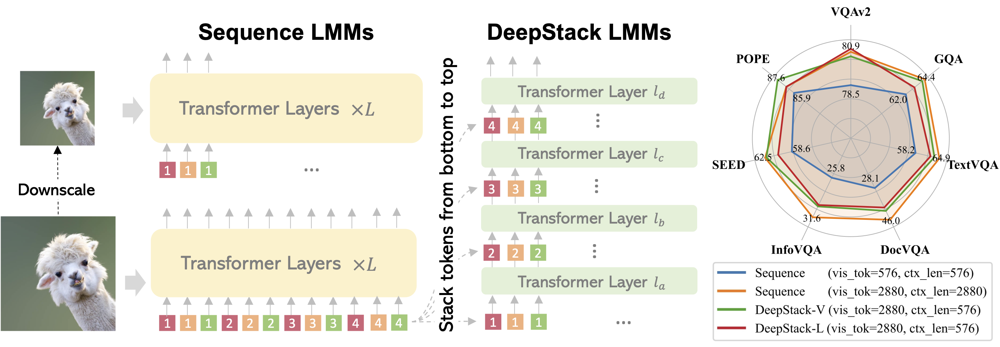
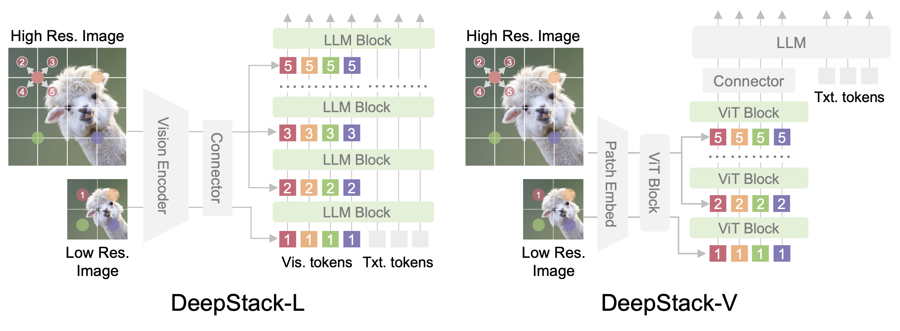
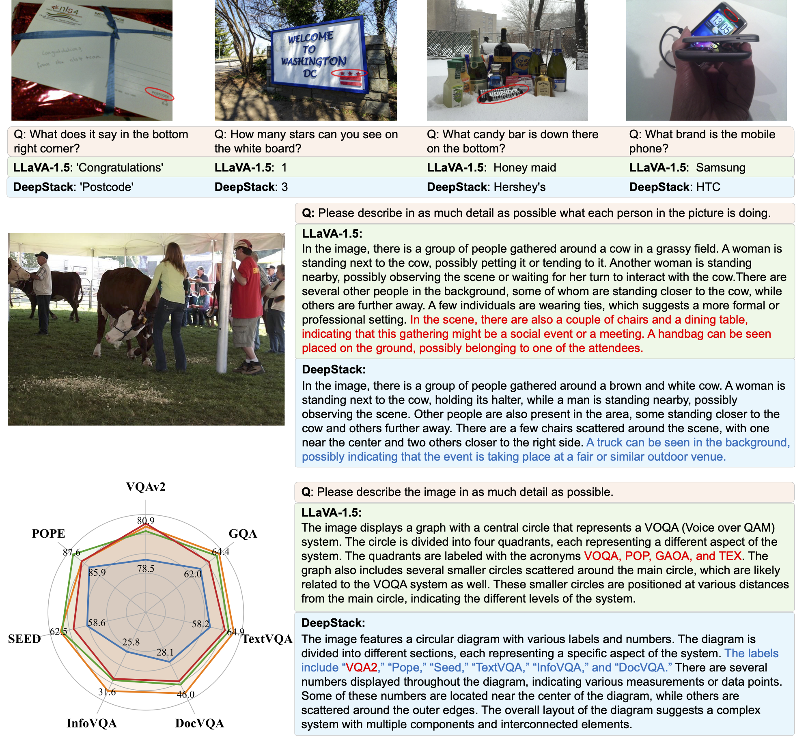

# <i>DeepStack</i>: Deeply Stacking Visual Tokens is Surprisingly Simple and Effective for LMMs

### [Project Page](https://deepstack-vl.github.io/) | [Paper (ArXiv)](https://arxiv.org/abs/2406.04334)

In this work, we introduce DeepStack, a simple and effective strategy for providing informative visual information by stacking visual tokens from bottom to top, maintaining the same visual context length.

## ⏳ : To Do
- [ ] Release training code
- [ ] Release test code
- [ ] Release pre-trained models


## DeepStack LMM


## DeepStack Architecture

The framework of DeepStack is quite simple: the main innovation lies in the DeepStack strategy that infuses visual tokens into different layers. 

DeepStack-L: DeepStack for LLMs. Given an input image, we feed the tokens extracted from the low-resolution version to the input layer of LLM. Considering the 2D nature of images, we extra the neighbors from the high-resolution version and reorganize them into DeepStack, which are then fed to the consequent layers in LLMs. 

DeepStack-V: DeepStack for ViTs. We apply similar sampling strategy but feed the visual tokens into the ViT layers of vision encoder.


## Examples



## Citation

If you find our work helpful for your research, please consider citing the following BibTeX entry.   

```bibtex
@misc{meng2024deepstack,
      title={DeepStack: Deeply Stacking Visual Tokens is Surprisingly Simple and Effective for LMMs}, 
      author={Meng, Lingchen and Yang, Jianwei and Tian, Rui and Dai, Xiyang and Wu, Zuxuan and Gao, Jianfeng and Jiang, Yu-Gang}
      publisher={arXiv:2406.04334},
      year={2024},
}

